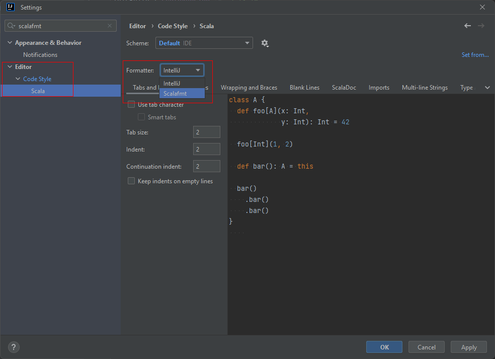

# Настройка форматирования

Если не настроено форматирование, у вас будет падать таск lint на CI, который проверяет сode style. 
Поэтому стоит настроить плагин scalafmt, который сам следит за кодстайлом и помогает переформатировать код как надо.  

1. Перейти в File > Settings
2. Вбить в поиск `scalafmt`
3. Выбрать меню Editor > Code Style > Scala
4. Выбрать в качестве форматировщика `Scalafmt`
5. Отметить галочку "reformat on Save"! Тогда при явном сохранении исходника scalafmt автоматически обновит ваш файл.
 
 
